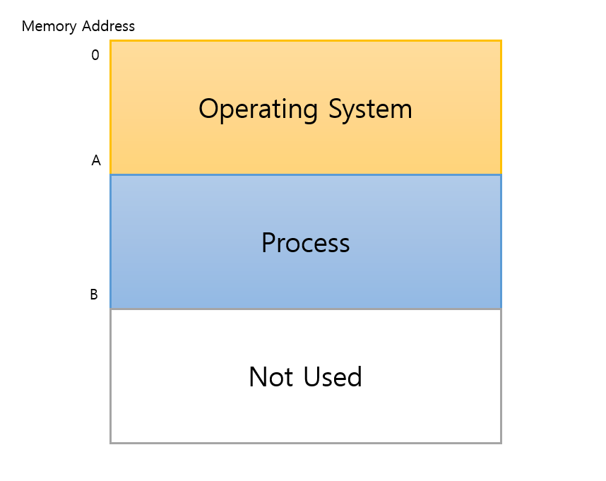

# 6. 메모리 관리

# 1. 프로세스와 메모리

프로세스가 동작하기 위해서는 CPU와 메모리는 필수적인 요소이다. 프로세스는 실행 중 프로그램 카운터(PC)가 참조하는 명령어를 읽어와서 실행한다. 여기서 PC가 참조하는 저장공간이 바로 메모리상의 공간이다.

단순한 형태의 메모리 구조

기억장치 계층구조

# 2. 단일 프로그래밍 환경

초기의 단일 프로그래밍 환경에서는 하나의 프로세스만 메모리를 사용하였다. 따라서 하나의 프로세스가 메모리에 연속된 블록으로 할당되는 연속 메모리 할당 방식을 이용하였다. 

- 단점
    - 메모리 용량을 초과하는 프로세스는 실행될 수 없다.
    - 사용되지 않는 프로세스도 메모리에 적재되어 있어야 한다.
    - 한 명의 유저가 메모리를 점거하고 있으므로 주변장치 등 자원의 낭비가 심하다.

단일 프로그래밍 환경에서의 CPU 이용

# 3. 다중 프로그래밍 환경

다중 프로그래밍(Multi Programming) 이란, 여러개의 프로세스가 메모리에 동시에 적재되는 것이다. 따라서 현재 실행중인 프로세스가 입출력 대기를 하는 동안, 실행을 기다리고 있는 다른 프로세스에 CPU를 할당할 수 있다. 즉, 입출력과 CPU연산을 병행 처리 가능해짐으로써 시스템 처리량이 증가하였다.

다중 프로그래밍 환경에서의 CPU 이용

## 1. 메모리 분할

여러 프로세스를 메모리에 적재하고 사용하려면, 당연하게도 메모리를 분할하여 적재하여야 한다. 프로세스를 적재하기 위해 메모리를 나누는 방식을 크게 두가지로 구분할 수 있는데, 고정 분할 방식과 동적 분할 방식이다.

### 1. 고정 분할

고정 분할은 이름 그대로 메모리를 여러 개의 고정된 영역으로 분할하는 방식이다. 

고정 분할의 예

이렇게 고정 분할한 메모리에 프로세스를 할당하기 위한 방법으로 두 가지 방법이 있다.  

첫 번째 방법은 각 분할된 영역에 따로 큐를 두고, 한 분할 영역에 하나의 프로세스를 적재하는 방식이다. 이는 각 프로세스가 어떠한 큐에서 작업할 지 정해져 있으므로 컴파일 시점에 **메모리의 절대주소**를 사용한다. 운영체제가 구현해야 할 작업 할당은 단순하지만 당연히 작업이 비어있는 분할 영역이 있어도 다른 프로세스의 작업을 적재할 수 없으므로 효율성이 떨어진다.

두 번째 방법은 메모리 전체에 하나의 작업 큐를 두고 모든 프로세스를 작업 큐에 넣어서 어느 분할 영역에서든지 실행 가능하도록 만드는 것이다.  프로세스 컴파일 시 어떠한 메모리 공간에도 적재가 가능하도록 상대주소를 사용하며, 적재될 주소 지정등의 문제를 해결하기 위한 구현이 복잡한 문제가 있다.

고정 분할에서는 분할 된 메모리 영역의 크기보다 적재 된 프로세스의 크기가 작아 분할 영역 내 메모리 낭비가 일어나는 **내부 단편화(fragmentation)** 문제가 있다.

### 2. 동적 분할

메모리 분할 경계가 고정되지 않고 각 프로세스에 필요한 만큼의 메모리만 할당하는 방식이다.

동적 분할의 예시

동적분할은 프로세스의 크기만큼 메모리가 분할되기 때문에 앞서 설명했던 내부 단편화 문제는 일어나지 않지만, 프로세스의 할당과 종료가 반복됨에 따라 작은 크기의 공백이 흩어지는 **외부 단편화** 문제가 발생한다.

외부 단편화의 예시

외부 단편화를 해결하는 방법으로는 **통합**과 **집약**이 있다.

통합(coalescing) 은 인접한 공백을 합쳐 더 큰 하나의 공백으로 만든다. 하지만 공백이 메모리 내 여기저기 분산되어 있는 경우에 효율적인 해결책이 될 수 없다.

집약(compaction) 은 메모리 내 공백을 하나로 모으는 작업이다.

## 2. 메모리 보호

메모리 상에 여러 프로세스가 동시에 상주하므로, 특정 프로세스의 명령어가 다른 프로세스의 메모리 영역이나 공백 영역을 침범하지 않도록 보호해야 할 필요가 있다.  따라서 하한-상한 레지스터 쌍 또는 하한-크기 레지스터 쌍을 사용하여 CPU 가 올바른 메모리 주소의 프로세스를 하고 있는지 체크한다. 이 영역을 넘는 메모리 공간을 호출하기 위해서는 운영체제를 통해 시스템 호출을 이용해야 한다.

# 4. 메모리 배치기법

프로세스 혹은 데이터를 적재할 때 메모리의 어느 위치에 적재할 것인가 결정하는 기법이다.

## 1. 최초 적합

프로세스가 **적재될 수 있는 빈 공간** 중 가장 **최초로 발견된 공간**에 적재한다.

## 2. 후속 적합

최초적합의 변형으로, 탐색을 **마지막 탐색 주소에서 시작**하여 적재가 가능한 빈 공간 중 최초로 발견된 공간에 적재한다.

## 3. 최적 적합

프로세스가 적재될 수 있는 빈 공간 중,  가장 적은 공간을 남기는 공간에 적재한다.

## 4. 최악 적합

최적 적합과 상반되는 기법으로, 너무 작은 공간이 많이 남는것을 방지하기 위해 프로세스가 적재될 수 있는 빈 공간 중, 가장 많은 공간을 남기는 공간에 적재한다.