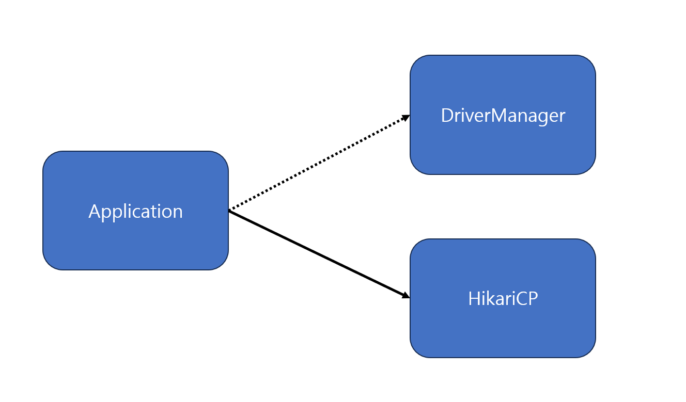
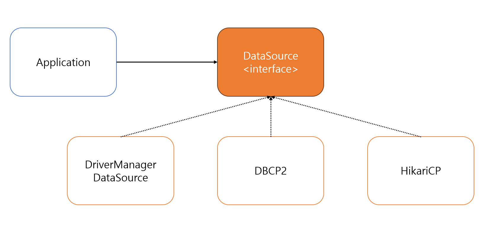

# Week 5 (2023-08-28 ~ 2023-09-03)

## Spring DB 1편 - JDBC 이해

### ResultSet Cursor 예시


- 커서가 최초 공백인 지점을 가르키고 있으므로 `rs.next()` 1회 호출부터 데이터를 가져옴
- 커서가 최종 row 를 지나면 false 를 반환

### 기타
- `@Data` 애노테이션이 붙은 두 객체가 서로 값이 같고 참조값이 다를 경우 
    ```java
    //false
    member1 == member2
    
    //true
    member1.equals(member2)
    ```
    - `@Data` 내부에 `@EqualsAndHashCode` 애노테이션을 포함하고 있음

## Spring DB 1편 - 커넥션풀과 데이터소스 이해

### 커넥션 풀
- JDBC 를 이용하여 커넥션을 얻기 위해서는 TCP/IP 3 way handshake, 인증, 세션 생성 등 복잡한 과정이 이루어진다.

- 이러한 문제를 해결하기 위해 만들어 진 것이 커넥션을 미리 생성해 두고 사용하는 커넥션 풀 개념이다.

- 서비스 특징 및 서버 스펙에 따라 차이가 있지만 보통 기본값 10개를 사용한다.

- 커넥션 풀은 애플리케이션 구동 시점에 생성되어 보관한다.

- 오픈소스 커넥션 풀을 사용하는데 `commons-dbcp2`, `tomcat-jdbc pool`, `HikariCP` 등을 사용한다. 대중적으로는 `HikariCP` 를 기본으로 많이 사용한다.

### DataSource
정리하자면 커넥션을 획득하는 방법은 다음 두가지 이다.
1. DriverManager 를 이용하여 신규 커넥션 생성
2. 커넥션 풀에서 만들어져 있는 커넥션 획득

커넥션 풀을 이용하기 위해서는 1번에서 애플리케이션 코드의 직접적 수정이 발생한다.




따라서 connection 을 얻는 과정 자체를 추상화 한 것이 `DataSource` 인터페이스이며, 자바 공식 인터페이스이다.

DriverManager 는 DataSource 인터페이스를 사용하지 않으므로, `DriverManagerDataSrouce` 라는 구현체를 사용하도록 한다.

## Spring DB 1편 - 트랜잭션 이해

### 개념
- 송금 (출금 -> 입금) 과 같이 하나의 작업처럼 실행되어야 하는 여러 작업 묶음을 의미
- 트랜잭션 ACID
    - 원자성: 트랜잭션 내 작업들은 모두 하나의 작업처럼 이루어져야 한다.
    - 일관성: 일관성 있는 데이터베이스 상태를 유지해야 한다.
    - 격리성: 동시에 실행되는 트랜잭션들이 서로에게 영향을 끼치지 않아야 한다.
    - 지속성: 트랜잭션이 끝나면 결과가 항상 기록되어야 한다.
- 트랜잭션 격리 수준
    - READ UNCOMMITED
    - READ COMMITED
    - REPEATABLE READ
    - SERIALIZABLE

### 세션
- WAS 나 DBA 프로그램을 통해 데이터베이스에서 커넥션을 획득하면 세션이 생성된다. - DB에 전송되는 모든 요청은 이 세션을 통해 이루어진다.
- 세션에서는 트랜잭션을 생성 후 시작 커밋, 롤백 등을 실행한다.