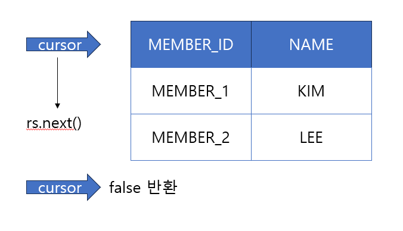

# Week 5 (2023-08-28 ~ 2023-09-03)

## Spring DB 1편 - JDBC 이해

### ResultSet Cursor 예시


- 커서가 최초 공백인 지점을 가르키고 있으므로 `rs.next()` 1회 호출부터 데이터를 가져옴
- 커서가 최종 row 를 지나면 false 를 반환

### 기타
- `@Data` 애노테이션이 붙은 두 객체가 서로 값이 같고 참조값이 다를 경우 
    ```java
    //false
    member1 == member2
    
    //true
    member1.equals(member2)
    ```
    - `@Data` 내부에 `@EqualsAndHashCode` 애노테이션을 포함하고 있음
