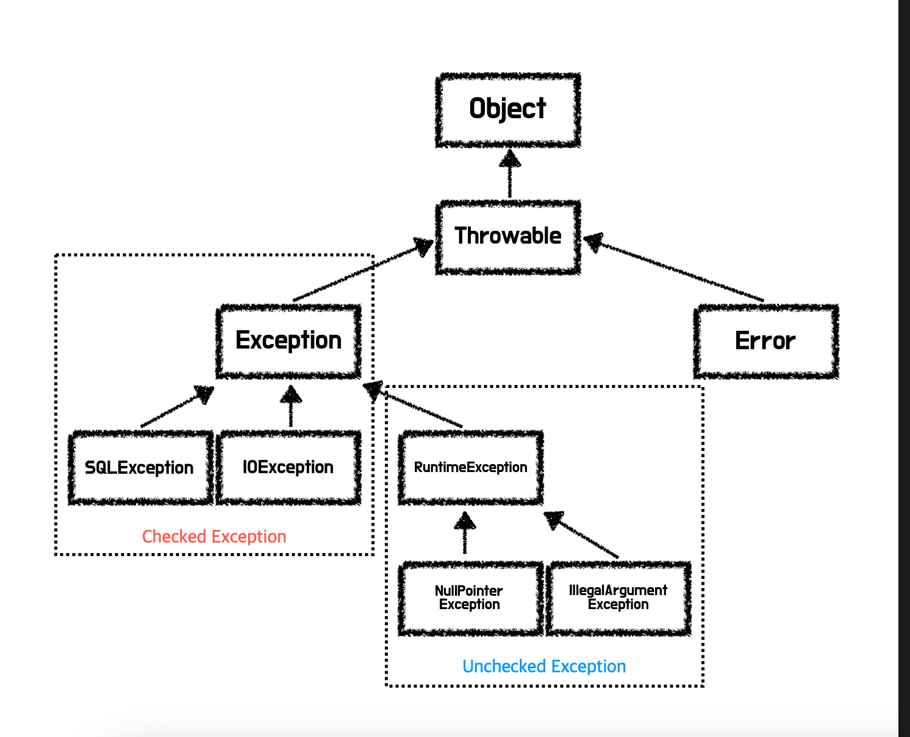

# Week 4 (2023-10-02 ~ 2023-10-08)

## Spring DB 1편 - 예외 처리 

- 자바 예외 기본
    - 모든 자바 예외는 `Throwable` 의 상속을 받는데, 이의 자식클래스는 `Exception` 과 `Error` 두 가지이다.
    - `Error` 클래스는 메모리 부족 등과 같이 애플리케이션 개발자가 다룰 수 없는 영역의 예외를 발생시키므로 이를 catch 구문으로 잡으려 해서는 안된다.
    - 따라서 애플리케이션 개발자가 다루는 모든 예외는 결국 `Exception` 클래스를 조상으로 생각하고 개발하여도 무관하다.

- Checked Exception
    - 쉽게 말하면 **반드시 체크 해야 하는 예외** 이다. 
    - 컴파일 단계에서 경고를 해주기 때문에 반드시 처리(catch) 하거나, 명시적으로 던져야 (throws) 하며, 모두 `Exception` 클래스를 상속받는다.

- Unchecked Exception (런타임 예외)
    - 체크하지 않아도 되는 예외이다.
    - `RuntimeException` 을 상속받으며, 처리하거나 명시적으로 던지지 않아도 된다. (물론 명시적으로 던져도 된다)
    - 던지지 않은 경우 Callstack 을 타고 main() 까지 올라가게 되며 이 경우 애플리케이션이 비정상 종료 된다.