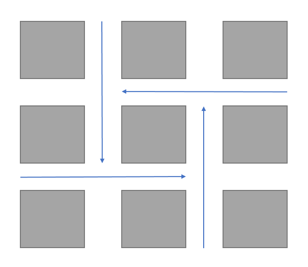

# 5. 교착상태

## 1. 교착상태의 개념

두개 이상의 프로세스가 서로 자원 할당을 위해 다른 프로세스의 작업이 끝나기만을 무한하게 기다리고 있는 상태를 의미한다.

기아상태는 프로세스의 일부가 자원 할당을 위한 대기가 지속적으로 일어나는 것을 의미하고, 교착상태는 모든 프로세스의 진행이 멈춘 상태를 의미한다.

교착 상태(deadlock) 의 도식

## 2. 교착상태의 특성

### 교착상태의 필요조건

1. 상호배제 조건
    - 배타적인 통제권을 의미한다.
2. 점유 대기 조건
    - 필요로 하는 자원을 다른 프로세스가 점유중이라면 반드시 대기해야 함
3. 비선점 조건
    - 다른 프로세스가 점유중인 자원을 빼앗을 수 없다. (자발적 반환만 허용)
4. 환형 대기 조건

### 자원할당 그래프

교착상태를 명확하게 표현하기 위해 사용하는 그래프를 의미한다.

- 정점
    - P : 프로세스를 의미하는 정점의 집합
    - R : 자원을 의미하는 정점의 집합
- 간선 (방향있는 간선의 집합)
    - Q (p → r) : 프로세스 p 가 자원 r 을 요구하는 것을 나타냄 (요구간선)
    - S (r → p) : 자원 r 가 프로세스 p 에 할당되어 있는 것을 나타냄 (할당간선)

교착상태를 나타낸 간선그래프의 예

## 3. 교착상태 처리

### 방지

1. 상호배제 조건의 제거 
    - 공유 불가능한 자원을 제거하는 것은 사실상 불가능하다.
2. 점유 대기 조건의 제거
    - 자원을 요청하는 시점에 어떠한 다른 자원도 점유하고 있지 않아야 한다.
    - 방법1. 작업을 시작하는 시점에 모든 자원을 한꺼번에 요청한다.
    - 방법2. 작업 단위별로 자원을 할당받고 다른 작업전에 모두 할당을 해제한다.
    - 첫 번째 방법은 자원 이용률이 현저히 떨어진다는 단점이 있고, 두 번째 방법은 기아상태를 유발할 수 있다.
3. 비선점 조건의 제거
    - 방법1. 다른 자원을 요청했으나 해당 자원을 즉시 할당받지 못하는 상황이면 점유중이던 자원을 모두 반환한다.
    - 방법2. 다른 자원을 요청했으나 점유중인 자원이라면 해당 자원을 점유하고 있는 프로세스가 다른 자원을 요청하며 대기상태에 있는지 확인한다. 만약 그렇다면 요청한 자원을 선점하여 가져온다.
    - CPU의 레지스터나 메모리 같이 상태를 쉽게 보관하고 복구할 수 있는 자원에만 사용 가능하다.
4. 환형 대기 조건의 제거
    - 방법1. 자원 유형에 일련번호를 지정하고 오름차순으로만 자원을 요청할 수 있게 한다.
    - 방법2. 방법1의 조건에서 낮은 순서의 자원을 요청해야 하면 높은 순서의 자원을 전부 할당 해제 한다.

### 회피

- 프로세스의 자원 사용에 대한 사전 정보를 활용하여 교착상태가 발생하지 않도록 방지하는 방법이다.
- 회피에 필요한 사전 정보로는 할당된 자원, 가용상태 자원, 프로세스들의 최대 요구량이 있다.
- 교착상태를 회피하면서 최대 요구량까지 빠짐없이 자원을 할당할 수 있는 상태를 안전상태(safe state) 라고 한다.

> 안전 순서열 (safe sequence)이란

순서 있는 프로세스 집합 P {p_1, p_2, …, p_n} 에 관하여 p_i 는 **p_i 가 추가로 요구할 수 있는 자원 소요량이 현재 가용 상태**이거나 혹은 **현재 가용인 자원에 더해 j < i 인 p_j 에 할당된 자원까지 포함하여 할당이 가능한 경우**를 안전 순서열이 존재한다고 한다.

즉, 현재 모든 프로세스가 자원을 할당받을 수 있거나, 자신보다 앞 순서의 프로세스들이 자원을 전부 반납하면 자신의 자원 요구량이 만족되는 상태를 의미한다.
> 

- 안전 순서열이 존재하는 경우를 안전 상태라고 하며, 안전 순서열이 존재하지 않는 경우는 불안전 상태라고 한다.
- 불안전 상태가 교착상태를 의미하지는 않는다. 할당 과정에 따라서 교착상태가 될 수도 있음을 의미한다.
- 안전 순서열을 보장하기 위해 유형별 단위자원이 여러개 있을경우와 하나만 있을경우로 나누어 사용하는 두가지 대표적인 알고리즘이 있다.

### 유형별 단위 자원이 여러 개일 경우

은행원 알고리즘이라고도 하며,  시스템이 자원을 요청받으면 자원을 할당해 주고 난 후의 상태가 안전상태가 되는지를 계산하여 안전상태가 되는 경우에만 할당하는 것이다.

은행원 알고리즘에는 다음과 같은 네 가지 데이터 구조를 정의해야 한다.

1. 가용자원 AVAIL
2. 최대요구 MAX
3. 할당자원 ALLOC
4. 추가요구 NEED

REQ_i 를 p_i 의 요구 벡터라 한다. REQ_i(j) = k 란, p_i 가 r_j 유형의 자원 k 개를 요구함을 의미한다. p_i 가 자원을 요청할때 다음과 같은 조건으로 알고리즘이 작동한다.

1. REQ_i ≤ NEED_i 가 TRUE 여야 한다. (자신의 최대 요구량 이상을 요청한 경우)
2. REQ_i ≤ AVAIL 이 거짓이면 p_i 는 대기상태로 전환된다.
3. REQ_i ≤ AVAIL 일 경우
    
    3-1. 다음과 같이 할당 후의 상태를 만든다.
    
    AVAIL = AVAIL - REQ_i
    
    ALLOC_i = ALLOC_i + REQ_i
    
    NEED_i = NEED_i - REQ_i
    
    3-2. 이 상태가 안전상태인지 조사한다.
    
    3-3. 안전 상태이면 REQ_i 를 할당한다.
    
    3-4. 불안전 상태라면 프로세스를 대기상태로 만들고 데이터를 되돌린다.
    

### 각 유형의 단위자원이 하나밖에 없을 경우

은행원 알고리즘은 매번 m * n^2 연산을 수행해야하므로 단위자원이 하나인 경우 자원할당 그래프를 이용하여 사이클이 발생하는 경우를 탐지하고 이를 미연에 방지하는 알고리즘을 이용한다.

### 교착상태의 탐지 및 복구

- 교착상태가 발생하는 것에 대비해 적절한 탐지 알고리즘을 사용하여 복구하는 것이 중요하다.
- 탐지 알고리즘 역시 비용이 소모되므로 CPU의 효율이 일정 수준 이하로 내려갈 때마다 탐지 알고리즘을 수행한다.
- 교착상태 복구를 위해 교착상태에 들어간 프로세스 전체를 종료하는 방법과, 사이클이 제거될 떄 까지 하나씩 종료시키는 방법이 있다.
    1. 전체를 종료하게 되면 복원 비용이 많이 소모되게 된다
    2. 하나씩 종료하면 우선순위와 진척도, 사용된 자원등 다양한 요소를 고려해야 한다.

### 복합적 접근

앞서 기술한 교착상태 방지, 회피, 탐지 및 복구 등을 복합적으로 사용하여 교착상태를 해결해야 한다. 이를 위해서는 우선 시스템을 구성하는 자원을 유형별로 구분한다.

1. 내부 자원 (PCB 와 같이 시스템에 사용)
2. 메모리 
3. 작업용 자원 (테이프 장치 등)
4. 교체 가능 공간 (보조기억장치 등)

이상적인 조합을 위해 각 유형에 따라 다음과 같이 적절한 방법을 선택한다.

이는 일부 자원에 대한 예시이며 자원에 따라 더 다양한 조합이 있을 수 있다.

1. 내부자원은 자원에 순서를 주는 교착상태 방지를 선택
    
    → 수행되면서 기다리는 요청 중에 할당 대상을 선택할 필요가 없음
    
2. 선점을 통해 교착상태 방지
    
    → 메모리 및 CPU 작업은 교체가 가능함
    
3. 작업용 작업 등은 교착상태 회피를 선택
    
    → 자원에 대한 정보를 작업제어 카드로 얻을 수 있음
    
4. 교체 가능 공간에 대해서는 사전 할당을 선택
    
    → 기억장치의 최대 사용량을 일반적으로 미리 알 수 있음